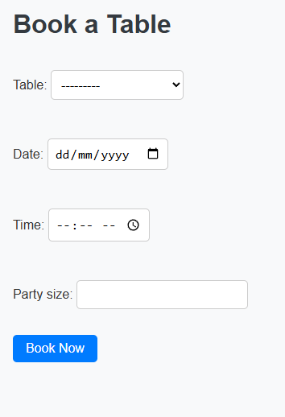
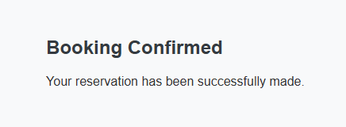
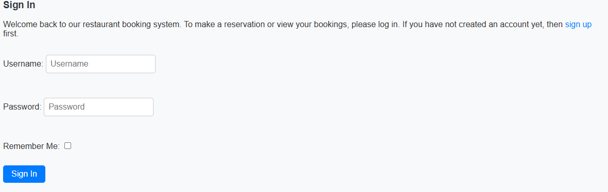
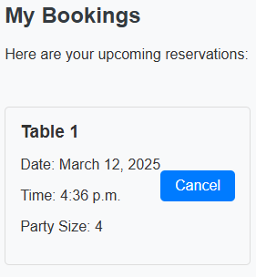
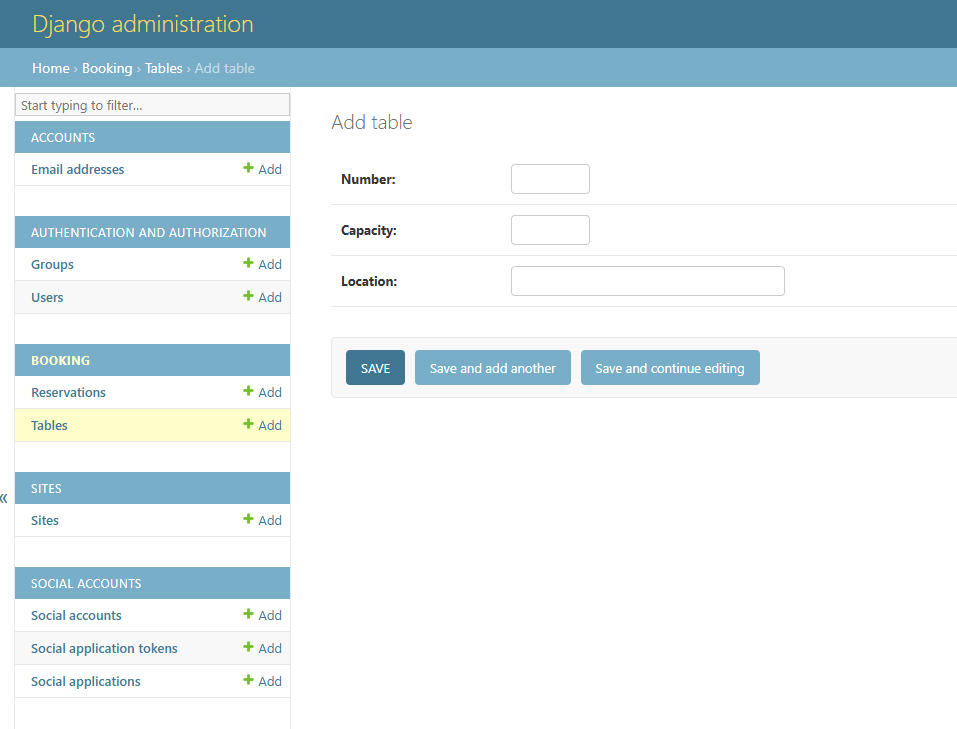
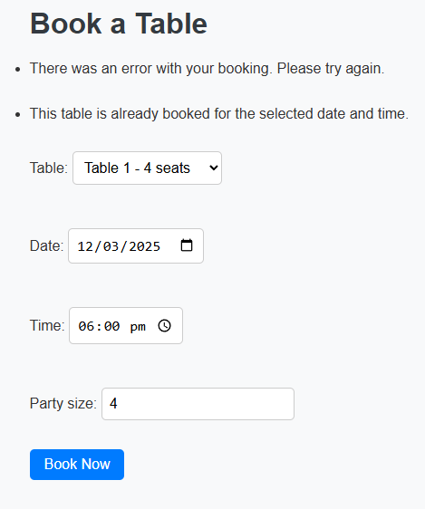

# Restaurant Booking System

**View the live project [here](https://restaurant-booking1-e41bd380dfd7.herokuapp.com/).**

## Project Overview

The Restaurant Booking System is a fully-functioning, interactive web application designed to manage table reservations for a restaurant. The application allows users to create, view, edit, and delete reservations, ensuring a seamless booking experience. The project follows the principles of UX design, accessibility guidelines, and is built using the Django MVC framework.

## Table of Contents

1. [Project Overview](#project-overview)
2. [Features](#features)
3. [Technologies Used](#technologies-used)
4. [Installation](#installation)
5. [Usage](#usage)
6. [Data Model](#data-model)
7. [User Stories](#user-stories)
8. [Testing](#testing)
9. [Deployment](#deployment)
10. [Security Considerations](#security-considerations)
11. [Contributing](#contributing)
10. [Credits](#credits)
11. [Acknowledgements](#acknowledgements)

## Features

- **User Registration and Login**: Secure user authentication with role-based access control.
- **Table Reservations**: Users can create, view, edit, and delete table reservations.
- **Responsive Design**: The application is fully responsive and works on desktop, tablet, and mobile devices.
- **Data Validation**: Input validation to ensure data integrity.
- **User Feedback**: Clear confirmation and error messages to guide users.
- **Admin Dashboard**: Admin users can manage tables and reservations.
## Technologies Used

- **Languages**: Python, HTML5, CSS3, JavaScript
- **Frameworks**: Django, Bootstrap
- **Database**: PostgreSQL
- **Version Control**: Git & GitHub
- **Deployment**: Heroku

## Installation

1. Clone the repository:
    ```bash
    git clone https://github.com/yourusername/restaurant_booking.git
    cd restaurant_booking
    ```

2. Create a virtual environment and activate it:
    ```bash
    python -m venv venv
    source venv/bin/activate  # On Windows use `venv\Scripts\activate`
    ```

3. Install the required packages:
    ```bash
    pip install -r requirements.txt
    ```

4. Set up the database:
    ```bash
    python manage.py makemigrations
    python manage.py migrate
    ```

5. Create a superuser:
    ```bash
    python manage.py createsuperuser
    ```

6. Run the development server:
    ```bash
    python manage.py runserver
    ```

## Usage

1. Register a new user or log in with an existing account.
2. Navigate to the reservations page to create a new reservation.
3. View, edit, or delete existing reservations.
4. Admin users can manage all reservations and user accounts.

## Data Model

The data model consists of the following entities:

- **User**: Represents a user of the system with role-based access.
- **Table**: Represents a table in the restaurant with attributes like table number and capacity.
- **Reservation**: Represents a reservation made by a user, linked to a specific table and time slot.

### Schema

```python
class Table(models.Model):
    table_number = models.IntegerField(unique=True)
    capacity = models.IntegerField()

class Reservation(models.Model):
    user = models.ForeignKey(User, on_delete=models.CASCADE)
    table = models.ForeignKey(Table, on_delete=models.CASCADE)
    reservation_time = models.DateTimeField()
    guests = models.IntegerField()
```

## User Stories

### Guest

1. **As a guest, I can view the restaurant's booking option so that I know when I can make a reservation.**
    - **Acceptance criteria 1**: The landing page displays essential restaurant information (e.g., location, hours, and a "Book a Table" button).
    - **Acceptance criteria 2**: The booking page intuitively shows available dates and time slots.
    - **Acceptance criteria 3**: The pages are responsive and render correctly on desktop, tablet, and mobile devices.

    
    

2. **As a guest, I can fill out a booking form so that I can reserve a table without registering immediately.**
    - **Acceptance criteria 1**: The booking form includes input fields for date, time, and party size.
    - **Acceptance criteria 2**: The system validates inputs (e.g., date is in the future, party size is positive).
    - **Acceptance criteria 3**: A clear confirmation message is displayed after a successful reservation, or an error is shown if no table is available.

    
    

### Customer

3. **As a customer, I can log in and view my reservations so that I can manage or cancel my bookings.**
    - **Acceptance criteria 1**: Users can securely register, log in, and log out.
    - **Acceptance criteria 2**: The "My Bookings" page lists all current and past reservations with details like date, time, and party size.
    - **Acceptance criteria 3**: Users can cancel an upcoming reservation and receive a cancellation confirmation.

    
    

### Administrator

4. **As an administrator, I can manage table and reservation records so that I can efficiently control restaurant capacity and bookings.**
    - **Acceptance criteria 1**: The admin dashboard allows CRUD operations (create, read, update, delete) on table records (e.g., table number, capacity, location).
    - **Acceptance criteria 2**: The dashboard displays a summary of all reservations and enables filtering by date or status.
    - **Acceptance criteria 3**: Only authenticated admin users have access to these management features.

    

### User

5. **As a user, I can receive booking confirmation notifications so that I have assurance my reservation is successfully made.**
    - **Acceptance criteria 1**: Upon a successful booking, a confirmation page with reservation details is displayed.
    - **Acceptance criteria 2**: (Optional) A confirmation email is sent to the user's email address with booking details.
    - **Acceptance criteria 3**: Clear error messages are provided if the reservation fails (e.g., due to table unavailability).

    

## Testing

### Automated Testing

Automated tests are implemented using Django's testing framework. The tests cover the following aspects:

- Model tests to ensure data integrity
- View tests to verify the correct rendering of templates
- Form tests to validate user input

To run the tests, use the following command:

```bash
python manage.py test
```

### Performance Testing

Performance testing was conducted using Lighthouse. The results are:

- **Performance**: 82
- **Accessibility**: 92
- **Best Practices**: 100
- **SEO**: 91

### Manual Testing

Manual testing was conducted to assess the following:

- Functionality: Ensuring all features work as expected
- Usability: Verifying the user interface is intuitive and accessible
- Responsiveness: Checking the application on different devices and screen sizes

### Test Results

All automated tests passed successfully. Manual testing revealed no major issues. Minor bugs were documented and fixed.

## Deployment

The application is deployed on Heroku. Follow these steps to deploy:

1. Create a Heroku account and install the Heroku CLI.
2. Log in to Heroku:
    ```bash
    heroku login
    ```

3. Create a new Heroku app:
    ```bash
    heroku create your-app-name
    ```

4. Set up environment variables:
    ```bash
    heroku config:set SECRET_KEY='your-secret-key'
    heroku config:set DEBUG=False
    ```

5. Push the code to Heroku:
    ```bash
    git push heroku main
    ```

6. Run database migrations on Heroku:
    ```bash
    heroku run python manage.py migrate
    ```

7. Create a superuser on Heroku:
    ```bash
    heroku run python manage.py createsuperuser
    ```

## Security Considerations

- Secret keys and passwords are stored in environment variables and not committed to the repository.
- User permissions are enforced to restrict access to certain features.
- The application runs in production mode with `DEBUG` turned off.

## Contributing

Contributions are welcome! Please follow these steps to contribute:

1. Fork the repository.
2. Create a new branch for your feature or bug fix:
    ```bash
    git checkout -b feature-name
    ```

3. Commit your changes with descriptive messages:
    ```bash
    git commit -m "Add new feature"
    ```

4. Push your changes to the branch:
    ```bash
    git push origin feature-name
    ```

5. Create a pull request with a detailed description of your changes.

## Credits

- **Django Documentation**: For guidance on using the Django framework.
- **Heroku Documentation**: For deployment instructions.

## Acknowledgements

- **Mentor**: Thanks to my mentor for guidance and support throughout the project.
- **Family and Friends**: For testing the application and providing valuable feedback.
- **Code Institute**: For providing the resources and support to complete this project.